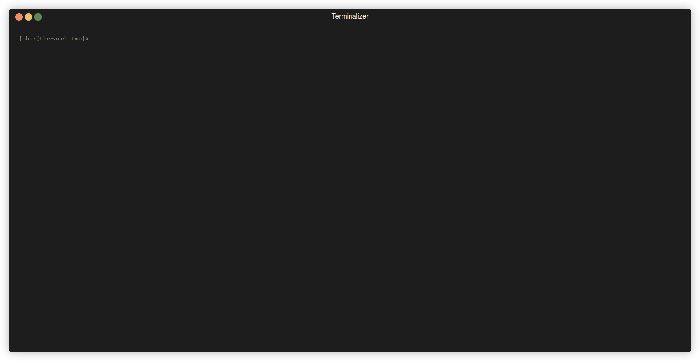

<div align="center">
  
  <p></p>
  <p>
    
  </p>
  <p>the cli for the simple snippet manager service</p>
</div>

<p align="center">
  <br>
  
  <br>
</p>

# pwyll-cli

The server side repo of [pwyll](https://github.com/carvilsi/pwyll) in case you want to install it.

## Install

`$ npm install -g pwyll-cli`

## Usage

**pwyll-cli [options] command**

**Options**:

    -V, --version            output the version number
    -h, --help               display help for command


**Commands**:

    signup           do the sign up, creating a new user and dealing with configuration
    s|search         searches snippets for the current signed up user and copies the selected one to the clipboard
    sa|search-all    searches snippets from any user and copies the selected one to the clipboard
    n|new            creates new snippet for the current signed up user
    u|update         updates a snippet for the current signed up user
    d|delete         deletes a snippet for the current signed up user
    e|export <file>  exports all the signed in user snippets to json file
    i|import <file>  imports the snippets from a json file for the signed in user
    help [command]   display help for command

### Keys

Query snippets while typing.

|  Key binding  |                                  Description                                                |
|---------------|---------------------------------------------------------------------------------------------|
| `Arrow down`  | move down selected snippet                                                                  |
| `Arrow up`    | move up selected snippet                                                                    |
| `Arrow right` | selects last snippet                                                                        |
| `Arrow left`  | selects first snippet                                                                       |
| `Enter`       | copy selected snippet to clipboard and exit (paste it later with `ctrl+v` or `ctrl+shift+v` |
| `ctrl-c`      | exit                                                                                        |

## Configuration

The configuration file, JSON format, is on the user home foler: 
`$HOME/.pwyll-cli/pwyll-config.json`
This file is generated when using `pwyll-cli signup`

Example of basic configuration file:

```json
{
  "pwyllUrl": "http://localhost:46520",
  "username": "Frodo Baggins",
  "userID": "00e5f795fff0ce4a10c06000",
  "secret": "user test super secret"
}
```

By default the cli has colors, you can disable them via config file, like: 

```json
{
  "pwyllUrl": "http://localhost:46520",
  "username": "Frodo Baggins",
  "userID": "00e5f795fff0ce4a10c06000",
  "secret": "user test super secret", 
  "colors": { 
    "enabled": false 
  }
}
```

Also it's possible to customize the colors, this is an example:

```json
{
  "pwyllUrl": "http://localhost:46520",
  "username": "Frodo Baggins",
  "userID": "00e5f795fff0ce4a10c06000",
  "secret": "user test super secret", 
  "colors": { 
    "enabled": true, 
    "selectedSnippet": "yellowBright", 
    "selectedDescription": "blueBright", 
    "snippet": "yellow", 
    "description": "blue" 
  }
}
```

The colors feature is based on [chalk](https://www.npmjs.com/package/chalk) there you can find all the supported colors.

---

Feedback from usage and contributions are very welcome.
Also if you like it, please leave a :star: I would appreciate it ;)
